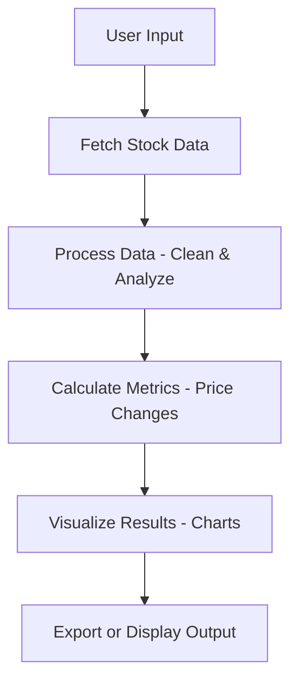

# JPMorgan Chase Analytics

This repository contains a job simulation project modeled after a real-world task for JPMorgan Chase. It is designed to test and demonstrate skills in data analysis, visualization, and engineering in a finance context. The project provides a realistic experience simulating tasks a new analyst might encounter.

---

## Table of Contents

- [Project Overview](#project-overview)
- [Features](#features)
- [Installation](#installation)
- [Usage](#usage)
- [Project Structure](#project-structure)
- [Data Flow & Architecture](#data-flow--architecture)
- [API Documentation](#api-documentation)
- [Testing](#testing)
- [Contributing](#contributing)
- [Troubleshooting](#troubleshooting)
- [License](#license)
- [Acknowledgments](#acknowledgments)

---

## Project Overview

This project simulates a typical workflow for a JPMorgan Chase analyst. It focuses on processing, analyzing, and visualizing stock price data using Python and Jupyter notebooks. The simulation covers tasks such as data retrieval, calculation of key financial metrics, and interactive charting. The project is suitable for interview preparation and skill assessment in quantitative finance, data science, and related roles.
---
---

## 🧩 Business Context & Task Description

This project was completed as part of a **JPMorgan Chase job simulation**, where I worked in the role of a **Data Analyst supporting a commodity trading desk**.

### 📩 Business Scenario

Alex, a Vice President on the commodity trading desk, plans to begin trading **natural gas storage contracts**.  
However, the available market data lacked sufficient quality and granularity to accurately price long-term storage contracts.

The desk required:
- Clean historical natural gas price data  
- Analysis of long-term trends and seasonality  
- An estimation of future gas prices  
- A system that can return a price estimate for any given date  

Natural gas storage contracts involve:
- Buying gas at an **injection date**  
- Storing it in underground facilities  
- Selling it at a later **withdrawal date**  
- Profiting from **seasonal price differences** (e.g., buying in summer, selling in winter)

To support this strategy, reliable historical and projected price data is essential.

---

## 🎯 Task Objective

As the Data Analyst, my responsibility was to:

- Download monthly natural gas price data from an external source  
- Analyze historical price movements  
- Identify trends and seasonal patterns  
- Extrapolate prices one year into the future  
- Build a function that:
  - Takes a date as input  
  - Returns an estimated natural gas price for that date  
- Visualize the results to support business decision-making  

The dataset contains monthly natural gas prices from:

> **31st October 2020 to 30th September 2024**

Each data point represents the market price of natural gas delivered at the end of a month.

---

## 🛠️ Analytical Approach

To solve the problem, I implemented the following workflow:

1. **Data Ingestion**
   - Loaded historical natural gas price data from CSV

2. **Data Cleaning & Validation**
   - Checked for missing values  
   - Ensured correct date formatting  
   - Verified price consistency  

3. **Exploratory Data Analysis (EDA)**
   - Visualized historical price trends  
   - Calculated rolling averages  
   - Studied month-wise seasonal behavior  
   - Analyzed year-over-year price changes  

4. **Price Estimation Model**
   - Built a function that accepts a date as input  
   - Interpolates historical prices  
   - Extrapolates prices for one future year  

5. **Visualization & Business Interpretation**
   - Created charts to highlight trends and seasonality  
   - Summarized findings in business-friendly language  

This solution provides the trading desk with:
- A clearer understanding of market behavior  
- Data-driven support for storage contract pricing  
- A foundation for forecasting and risk evaluation  

---

## 👨‍💼 Role & Skills Demonstrated

This task reflects the responsibilities of a Data Analyst in a financial environment:

- Data wrangling and preprocessing  
- Time series analysis  
- Trend and seasonality detection  
- Visualization and storytelling with data  
- Translating technical results into business insights  

It also demonstrates practical use of:
- Python  
- pandas  
- matplotlib / Plotly  
- Analytical thinking in a finance context  

---


## 📊 Insights from the data

This section presents a structured exploratory analysis of historical natural gas prices. The objective is to understand long-term trends, seasonal behavior, and year-over-year changes to support better pricing, forecasting, and storage strategy decisions.

---

### 1. Historical Price Trend


This chart shows the full time series of monthly natural gas prices. It helps identify overall market direction, periods of high volatility, and major price swings. Such trend analysis is critical for understanding market cycles and for setting expectations when pricing long-term storage contracts.

**Insights:**
- Prices fluctuate significantly over time, indicating a volatile commodity market.
- There are visible phases of rising and falling prices, suggesting cyclical behavior.
- Sharp movements highlight periods of market stress or supply-demand imbalance.

---

### 2. Rolling Average (Trend Smoothing)


The rolling average smooths short-term noise and makes long-term trends easier to interpret. This is useful for separating temporary fluctuations from structural market movements.

**Insights:**
- The smoothed line reveals clearer upward and downward trend phases.
- Short-term spikes are reduced, helping focus on the underlying market direction.
- This view is helpful for medium- to long-term planning and strategy decisions.

---

### 3. Seasonal Price Patterns


This chart shows average prices by month, helping identify seasonal effects in natural gas pricing. Seasonality is especially important for storage strategies, where gas is often bought in low-price periods and sold in high-price periods.

**Insights:**
- Prices vary by month, indicating a seasonal component in demand and supply.
- Certain months tend to have higher average prices, which may align with peak demand periods.
- This pattern supports the business case for seasonal storage and arbitrage strategies.

---

### 4. Year-over-Year Price Changes


Year-over-year (YoY) changes highlight how prices evolve compared to the same period in the previous year. This helps assess market growth, contraction, and overall stability.

**Insights:**
- There are periods of strong positive and negative YoY changes, showing market instability.
- Large swings indicate that external factors (e.g., supply shocks, demand changes) can significantly impact prices.
- YoY analysis is useful for risk assessment and scenario planning.

---

### 🧠 Key Business Takeaways

- Natural gas prices are highly volatile, making risk management and forecasting essential.
- Trend and rolling average analysis help distinguish long-term movements from short-term noise.
- Clear seasonal patterns support storage-based trading strategies (buy low, sell high).
- Year-over-year variability highlights the need for conservative assumptions in long-term contract pricing.
- Overall, this analysis provides a data-driven foundation for pricing, storage decisions, and risk evaluation in commodity markets.

---


---

## Features

- Fetches and processes stock price data from external APIs.
- Computes price changes and technical indicators.
- Visualizes results using interactive charts.
- Demonstrates modular code structure and clear workflow.
- Written in Python, leveraging pandas, Plotly, and standard libraries.
- Includes clear documentation and testable code blocks.

---

## Installation

To set up this project locally, follow these steps:

1. **Clone the repository:**
   ```bash
   git clone https://github.com/wahaab927/JPMorgan-Chase-job-simulation.git
   cd JPMorgan-Chase-job-simulation
   ```

2. **Install the required packages:**
   ```bash
   pip install -r requirements.txt
   ```

3. **(Optional) Set up a virtual environment:**
   ```bash
   python -m venv venv
   source venv/bin/activate  # On Windows: venv\Scripts\activate
   ```

4. **Start Jupyter Notebook:**
   ```bash
   jupyter notebook
   ```
   Open the notebook in your browser and run the cells as instructed.

---

## Usage

Follow these instructions to use the simulation:

- Launch the Jupyter notebook and execute each cell in order.
- Update input parameters (such as stock symbols or date ranges) as needed in designated cells.
- Review the generated plots and tables for insights.
- Use the code comments for guidance on each step.
- Modify or extend the analysis for new questions.

---

## Project Structure

The repository typically contains the following elements:

- `notebooks/`: Contains Jupyter notebooks for stepwise simulation.
- `src/`: Source Python files with reusable functions (data fetching, calculations, plotting).
- `requirements.txt`: Lists required Python packages.
- `README.md`: This documentation file.
- `data/`: (If present) Contains sample or cached data files for rapid prototyping.
- `tests/`: (If present) Contains test cases for core functions.

A typical directory structure:

```
JPMorgan-Chase-job-simulation/
├── notebooks/
│   └── JPMorgan_Job_Simulation.ipynb
├── src/
│   ├── data.py
│   ├── plot.py
│   └── utils.py
├── requirements.txt
├── README.md
└── tests/
    └── test_data.py
```

---

## Data Flow & Architecture

The simulation follows a modular and readable data pipeline. The main flow is:

- **Data Ingestion:** Load stock price data from an API or local source.
- **Data Processing:** Compute price changes and technical indicators.
- **Visualization:** Generate and display charts for analysis.
- **Export:** Save results or plots if needed.

Below is a simplified data flow:



---

## API Documentation

If the project fetches data from an external API, ensure your API keys and endpoints are set as environment variables or in a config file.

### Fetch Stock Price Data - GET

#### Get Stock Price Data

```api
{
    "title": "Fetch Stock Price Data",
    "description": "Retrieves historical price data for a given stock symbol from an external data provider.",
    "method": "GET",
    "baseUrl": "https://api.example.com",
    "endpoint": "/v1/prices/{symbol}",
    "headers": [
        {
            "key": "Authorization",
            "value": "Bearer <API_KEY>",
            "required": true
        }
    ],
    "queryParams": [
        {
            "key": "start_date",
            "value": "Start date in YYYY-MM-DD format",
            "required": false
        },
        {
            "key": "end_date",
            "value": "End date in YYYY-MM-DD format",
            "required": false
        }
    ],
    "pathParams": [
        {
            "key": "symbol",
            "value": "Stock symbol (e.g., AAPL)",
            "required": true
        }
    ],
    "bodyType": "none",
    "responses": {
        "200": {
            "description": "Success",
            "body": "{\n  \"symbol\": \"AAPL\",\n  \"prices\": [\n    { \"date\": \"2023-01-01\", \"close\": 150.0 }, ... ]\n}"
        },
        "404": {
            "description": "Symbol not found",
            "body": "{\n  \"error\": {\n    \"message\": \"Symbol not found\"\n  }\n}"
        }
    }
}
```

---

## Testing

To ensure the correctness of the code, run the test suite (if present):

```bash
pytest tests/
```

- Test cases cover data fetching, calculations, and chart generation.
- Review test output for failures and debug as necessary.

---

## Contributing

Contributions are welcome! To contribute:

- Fork this repository.
- Create a new branch for your feature or bugfix.
- Write clear commit messages and document your changes.
- Submit a pull request with a summary of your updates.
- Follow existing code style and add/modify tests as needed.

---

## Troubleshooting

- Ensure all dependencies are installed and compatible with your Python version.
- If data download fails, check your API key and network connection.
- For Jupyter issues, restart the kernel or clear outputs.
- Check log outputs and error messages for debugging guidance.
- For permission errors, verify file and folder permissions.

---

## License

This repository is licensed under the MIT License. See [LICENSE](LICENSE) for details.

---

## Acknowledgments

- Inspired by real-world tasks at JPMorgan Chase.
- Uses open-source Python libraries such as pandas and Plotly.
- Thanks to the community for feedback and improvements.

---

```card
{
    "title": "Start Simulating Now",
    "content": "Clone the repository, run the notebook, and dive into data analysis with realistic tasks from the world of finance."
}
```
