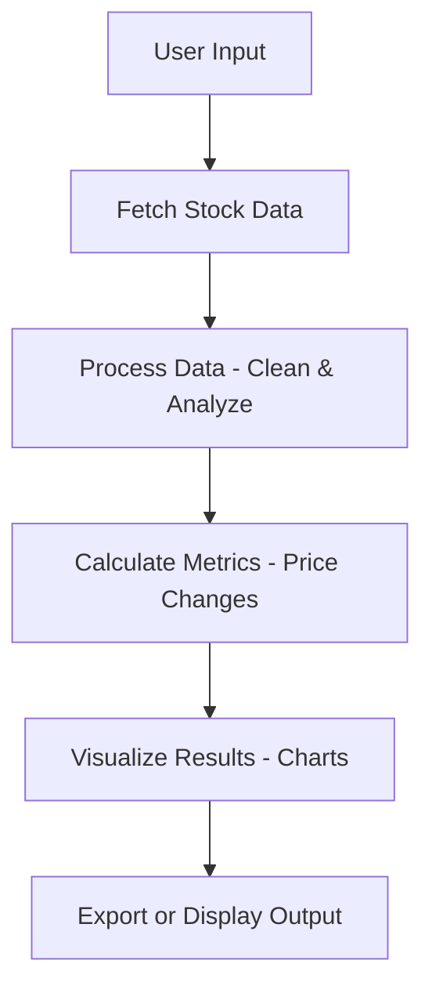

# JPMorgan Chase Analytics

This repository contains a job simulation project modeled after a real-world task for JPMorgan Chase. It is designed to test and demonstrate skills in data analysis, visualization, and engineering in a finance context. The project provides a realistic experience simulating tasks a new analyst might encounter.

---

## Table of Contents

- [Project Overview](#project-overview)
- [Features](#features)
- [Installation](#installation)
- [Usage](#usage)
- [Project Structure](#project-structure)
- [Data Flow & Architecture](#data-flow--architecture)
- [API Documentation](#api-documentation)
- [Testing](#testing)
- [Contributing](#contributing)
- [Troubleshooting](#troubleshooting)
- [License](#license)
- [Acknowledgments](#acknowledgments)

---

## Project Overview

This project simulates a typical workflow for a JPMorgan Chase analyst. It focuses on processing, analyzing, and visualizing stock price data using Python and Jupyter notebooks. The simulation covers tasks such as data retrieval, calculation of key financial metrics, and interactive charting. The project is suitable for interview preparation and skill assessment in quantitative finance, data science, and related roles.

---

## Features

- Fetches and processes stock price data from external APIs.
- Computes price changes and technical indicators.
- Visualizes results using interactive charts.
- Demonstrates modular code structure and clear workflow.
- Written in Python, leveraging pandas, Plotly, and standard libraries.
- Includes clear documentation and testable code blocks.

---

## Installation

To set up this project locally, follow these steps:

1. **Clone the repository:**
   ```bash
   git clone https://github.com/wahaab927/JPMorgan-Chase-job-simulation.git
   cd JPMorgan-Chase-job-simulation
   ```

2. **Install the required packages:**
   ```bash
   pip install -r requirements.txt
   ```

3. **(Optional) Set up a virtual environment:**
   ```bash
   python -m venv venv
   source venv/bin/activate  # On Windows: venv\Scripts\activate
   ```

4. **Start Jupyter Notebook:**
   ```bash
   jupyter notebook
   ```
   Open the notebook in your browser and run the cells as instructed.

---

## Usage

Follow these instructions to use the simulation:

- Launch the Jupyter notebook and execute each cell in order.
- Update input parameters (such as stock symbols or date ranges) as needed in designated cells.
- Review the generated plots and tables for insights.
- Use the code comments for guidance on each step.
- Modify or extend the analysis for new questions.

---

## Project Structure

The repository typically contains the following elements:

- `notebooks/`: Contains Jupyter notebooks for stepwise simulation.
- `src/`: Source Python files with reusable functions (data fetching, calculations, plotting).
- `requirements.txt`: Lists required Python packages.
- `README.md`: This documentation file.
- `data/`: (If present) Contains sample or cached data files for rapid prototyping.
- `tests/`: (If present) Contains test cases for core functions.

A typical directory structure:

```
JPMorgan-Chase-job-simulation/
├── notebooks/
│   └── JPMorgan_Job_Simulation.ipynb
├── src/
│   ├── data.py
│   ├── plot.py
│   └── utils.py
├── requirements.txt
├── README.md
└── tests/
    └── test_data.py
```

---

## Data Flow & Architecture

The simulation follows a modular and readable data pipeline. The main flow is:

- **Data Ingestion:** Load stock price data from an API or local source.
- **Data Processing:** Compute price changes and technical indicators.
- **Visualization:** Generate and display charts for analysis.
- **Export:** Save results or plots if needed.

Below is a simplified data flow:



---

## API Documentation

If the project fetches data from an external API, ensure your API keys and endpoints are set as environment variables or in a config file.

### Fetch Stock Price Data - GET

#### Get Stock Price Data

```api
{
    "title": "Fetch Stock Price Data",
    "description": "Retrieves historical price data for a given stock symbol from an external data provider.",
    "method": "GET",
    "baseUrl": "https://api.example.com",
    "endpoint": "/v1/prices/{symbol}",
    "headers": [
        {
            "key": "Authorization",
            "value": "Bearer <API_KEY>",
            "required": true
        }
    ],
    "queryParams": [
        {
            "key": "start_date",
            "value": "Start date in YYYY-MM-DD format",
            "required": false
        },
        {
            "key": "end_date",
            "value": "End date in YYYY-MM-DD format",
            "required": false
        }
    ],
    "pathParams": [
        {
            "key": "symbol",
            "value": "Stock symbol (e.g., AAPL)",
            "required": true
        }
    ],
    "bodyType": "none",
    "responses": {
        "200": {
            "description": "Success",
            "body": "{\n  \"symbol\": \"AAPL\",\n  \"prices\": [\n    { \"date\": \"2023-01-01\", \"close\": 150.0 }, ... ]\n}"
        },
        "404": {
            "description": "Symbol not found",
            "body": "{\n  \"error\": {\n    \"message\": \"Symbol not found\"\n  }\n}"
        }
    }
}
```

---

## Testing

To ensure the correctness of the code, run the test suite (if present):

```bash
pytest tests/
```

- Test cases cover data fetching, calculations, and chart generation.
- Review test output for failures and debug as necessary.

---

## Contributing

Contributions are welcome! To contribute:

- Fork this repository.
- Create a new branch for your feature or bugfix.
- Write clear commit messages and document your changes.
- Submit a pull request with a summary of your updates.
- Follow existing code style and add/modify tests as needed.

---

## Troubleshooting

- Ensure all dependencies are installed and compatible with your Python version.
- If data download fails, check your API key and network connection.
- For Jupyter issues, restart the kernel or clear outputs.
- Check log outputs and error messages for debugging guidance.
- For permission errors, verify file and folder permissions.

---

## License

This repository is licensed under the MIT License. See [LICENSE](LICENSE) for details.

---

## Acknowledgments

- Inspired by real-world tasks at JPMorgan Chase.
- Uses open-source Python libraries such as pandas and Plotly.
- Thanks to the community for feedback and improvements.

---

```card
{
    "title": "Start Simulating Now",
    "content": "Clone the repository, run the notebook, and dive into data analysis with realistic tasks from the world of finance."
}
```
